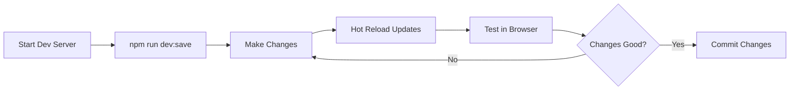

# Development Workflow Guide - Link Blog

## Quick Start

### First Time Setup
```bash
# 1. Clone repository
git clone <repository-url>
cd link-blog

# 2. Install dependencies
npm install

# 3. Create environment file
echo "VITE_ADMIN_PASSWORD=YourSecurePassword" > .env

# 4. Start development
npm run dev:save

# 5. Access application
# Frontend: http://localhost:5174
# Admin mode: http://localhost:5174/?admin=YourSecurePassword
```

## Development Workflows

### 1. Daily Development Flow



**Step-by-step**:
1. Start development environment: `npm run dev:save`
2. Open browser to http://localhost:5174
3. Enable admin mode with `?admin=YourPassword`
4. Make code changes - hot reload applies automatically
5. Test functionality in browser
6. Commit when ready

### 2. Adding New Links Workflow

#### Quick Add (Admin Mode)
1. Access admin mode: `http://localhost:5174/?admin=YourPassword`
2. Use Quick Add URL field
3. Enter URL and press Enter
4. System auto-fetches metadata
5. Review/edit suggested tags
6. Click Save

#### Bulk Import
1. Click "Import Bookmarks" in admin panel
2. Select browser bookmark HTML file
3. Choose folders to import (whitelist approach)
4. Preview links to be imported
5. Review for private URLs
6. Confirm import

#### Paste Multiple URLs
1. Copy multiple URLs (one per line)
2. Paste in Quick Add field
3. System processes all URLs in parallel
4. Review metadata and tags for each
5. Save all at once

### 3. Data Management Workflow

#### Backup Current Data
```bash
# Create timestamped backup
cp data/links.json "data/backup-$(date +%Y%m%d-%H%M%S).json"
```

#### Sync Browser to Files
```bash
# Run sync command
npm run sync

# In browser console:
copy(localStorage.getItem('linkBlogData'))

# Paste when prompted in terminal
```

#### Restore from Backup
```bash
# Copy backup to active files
cp data/backup-20250921.json data/links.json
cp data/backup-20250921.json public/data/links.json

# Restart dev server to load
npm run dev:save
```

### 4. Feature Development Workflow

#### Adding New Component
1. **Check existing components** in `src/components/`
2. **Create component file** following naming convention
3. **Use existing UI components** from `src/components/ui/`
4. **Import in parent component**
5. **Add to LinkBlog.jsx if needed**
6. **Test with different data states**

Example:
```javascript
// src/components/NewFeature.jsx
import { Card } from './ui/card';
import { Button } from './ui/button';

export function NewFeature({ data }) {
  // Implementation
}

// In LinkBlog.jsx
import { NewFeature } from './NewFeature';
```

#### Modifying Existing Features
1. **Locate feature** in `src/components/LinkBlog.jsx`
2. **Check for utilities** in `src/utils/`
3. **Make changes** preserving existing structure
4. **Test all related functionality**
5. **Verify data persistence**

### 5. Debugging Workflow

#### Frontend Issues
```javascript
// Add debug logging
console.log('Links state:', links);
console.log('Filtered results:', filteredLinks);

// Use React DevTools
// Check component props and state

// Verify localStorage
localStorage.getItem('linkBlogData')
```

#### API/Save Issues
```bash
# Check API server
curl -X POST http://localhost:3001/api/save-links \
  -H "Content-Type: application/json" \
  -d '{"links":[], "lastUpdated":"2025-09-21T10:00:00Z"}'

# Check file permissions
ls -la data/
ls -la public/data/

# Monitor server logs
# Logs appear in terminal running npm run dev:save
```

#### Data Corruption Recovery
1. Check localStorage in browser
2. Check both JSON file locations
3. Compare timestamps
4. Use most recent valid data
5. Restore using sync script

### 6. Testing Workflow

#### Manual Testing Checklist
- [ ] Add single link
- [ ] Add multiple links via paste
- [ ] Edit existing link
- [ ] Delete link
- [ ] Search functionality
- [ ] Tag filtering
- [ ] Sort options
- [ ] Keyboard navigation (J/K)
- [ ] Theme toggle
- [ ] Pin/unpin links
- [ ] Import bookmarks
- [ ] Data persistence after refresh

#### Browser Testing
```bash
# Test production build locally
npm run build
npm run preview
# Open http://localhost:4173
```

#### Performance Testing
1. Import large dataset (1000+ links)
2. Test search responsiveness
3. Check filter performance
4. Monitor memory usage
5. Verify smooth scrolling

### 7. Git Workflow

#### Feature Branch Development
```bash
# Create feature branch
git checkout -b feature/your-feature

# Make changes
# ... edit files ...

# Check status
git status

# Stage changes
git add .

# Commit with descriptive message
git commit -m "feat: add new feature description"

# Push to remote
git push -u origin feature/your-feature

# Create pull request
```

#### Commit Message Convention
```
type(scope): description

Types:
- feat: New feature
- fix: Bug fix
- docs: Documentation only
- style: Formatting, no code change
- refactor: Code restructuring
- test: Adding tests
- chore: Maintenance

Example:
feat(import): add duplicate detection for bookmarks
```

### 8. Deployment Workflow

#### Deploy to GitHub Pages
```bash
# 1. Ensure all changes committed
git status

# 2. Build production version
npm run build

# 3. Test build locally
npm run preview

# 4. Deploy to GitHub Pages
npm run deploy

# 5. Verify deployment
# Visit: https://[username].github.io/link-blog
```

#### Deploy to Custom Hosting

**Vercel**:
```bash
# Install Vercel CLI
npm i -g vercel

# Deploy
vercel

# Set environment variables in Vercel dashboard
```

**Netlify**:
```bash
# Build command: npm run build
# Publish directory: dist
# Add environment variables in site settings
```

### 9. Maintenance Workflow

#### Update Dependencies
```bash
# Check for updates
npm outdated

# Update all dependencies
npm update

# Update specific package
npm install package@latest

# Test after updates
npm run dev:save
```

#### Security Audit
```bash
# Run security audit
npm audit

# Fix automatically
npm audit fix

# Force fixes (use carefully)
npm audit fix --force
```

#### Performance Optimization
1. Run Lighthouse audit
2. Check bundle size: `npm run build`
3. Identify large dependencies
4. Implement code splitting if needed
5. Optimize images and assets

## Common Scenarios

### Scenario: "I need to add a new field to links"

1. Update data structure in component state
2. Modify storage utilities if needed
3. Update UI to display/edit new field
4. Add migration logic for existing data
5. Test with existing and new data

### Scenario: "Search is too slow"

1. Check debounce delay in search implementation
2. Profile with React DevTools Profiler
3. Optimize filter logic with useMemo
4. Consider virtualization for large lists
5. Implement pagination if needed

### Scenario: "I want to change the UI theme"

1. Modify Tailwind config
2. Update CSS variables in index.css
3. Adjust component classes
4. Test dark/light mode
5. Ensure accessibility maintained

### Scenario: "Import is failing"

1. Check bookmark file format
2. Verify HTML structure
3. Test with browser console
4. Check for special characters
5. Debug parsing logic

### Scenario: "Data not persisting"

1. Check API server running
2. Verify CORS settings
3. Check browser console for errors
4. Verify file write permissions
5. Test with manual save script

## Productivity Tips

### Keyboard Shortcuts

| Shortcut | Action | Context |
|----------|--------|---------|
| `Cmd/Ctrl+K` | Focus search | Global |
| `Cmd/Ctrl+V` | Quick paste URLs | Admin mode |
| `J` | Next link | Link list |
| `K` | Previous link | Link list |
| `Enter` | Open link | When focused |
| `Escape` | Clear search/filters | When active |

### VS Code Extensions

Recommended for this project:
- ES7+ React/Redux/React-Native snippets
- Tailwind CSS IntelliSense
- Prettier - Code formatter
- ESLint
- GitLens
- Thunder Client (API testing)

### Browser Tools

- React Developer Tools
- Redux DevTools (if adding state management)
- Lighthouse (performance)
- WAVE (accessibility)

## Troubleshooting Guide

### Problem: "Changes not appearing"

**Solutions**:
1. Check if dev server running
2. Hard refresh browser (Cmd+Shift+R)
3. Clear browser cache
4. Check for console errors
5. Verify file saved

### Problem: "Cannot save links"

**Solutions**:
1. Verify API server running (port 3001)
2. Check admin mode enabled
3. Inspect network tab for errors
4. Check CORS configuration
5. Verify file permissions

### Problem: "Import showing no folders"

**Solutions**:
1. Verify HTML bookmark format
2. Check for nested folder structure
3. Test with different browser export
4. Debug parser in console
5. Check for encoding issues

### Problem: "Lost all my links"

**Recovery Steps**:
1. Check localStorage in browser
2. Check data/links.json
3. Check public/data/links.json
4. Look for backup files
5. Use sync script to restore

### Problem: "Build failing"

**Solutions**:
1. Clear node_modules and reinstall
2. Check for TypeScript errors
3. Verify all imports resolve
4. Check environment variables
5. Review build logs carefully

## Best Practices

### Code Quality
- Run linter before commits: `npm run lint`
- Format code: `npm run format`
- Write descriptive commit messages
- Comment complex logic
- Keep components focused

### Performance
- Use React.memo for expensive components
- Implement proper key props in lists
- Debounce search and filter operations
- Lazy load heavy components
- Optimize bundle size

### Data Safety
- Regular backups of links.json
- Test with copy of production data
- Validate data before saving
- Handle errors gracefully
- Maintain data structure compatibility

### Security
- Never commit .env file
- Use environment variables for secrets
- Validate all user inputs
- Sanitize URLs and content
- Keep dependencies updated

---

Last Updated: 2025-09-21
Version: 1.0.0